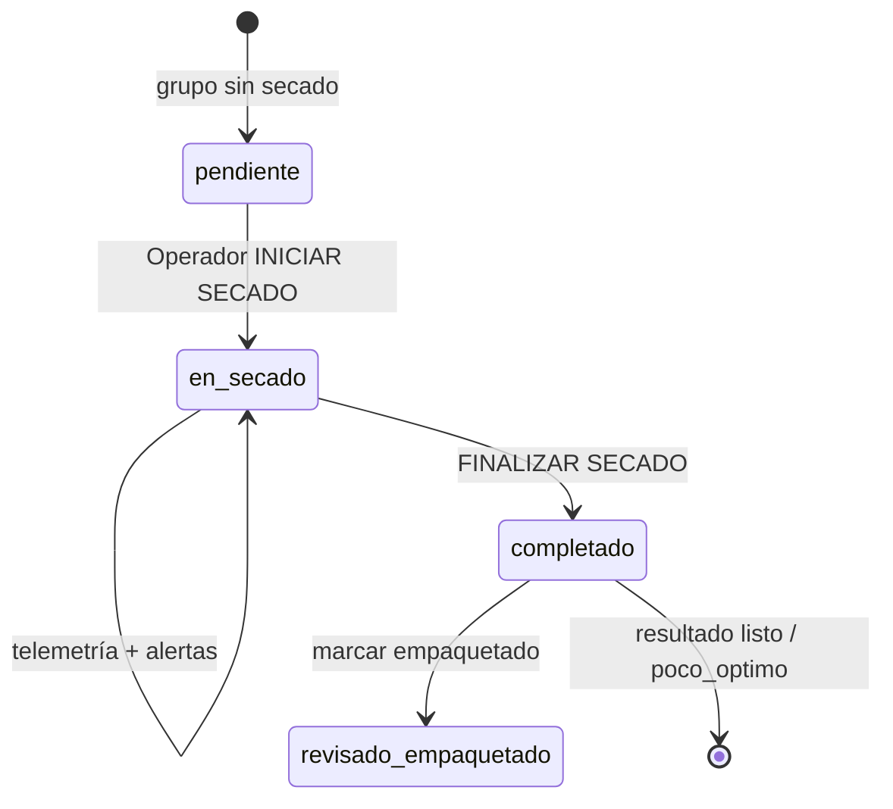

# Guía completa del sistema — App Harinas / Nativa

Documento de referencia para entender **cómo funciona todo** (backend → frontend), **dónde está el código** y **qué pantallas capturar en la app** para documentación visual (fotos, informe, APK).

> **Sobre el UML:** en este repositorio **no hay archivos `.uml` / `.puml`**. Los diagramas oficiales están aquí (Mermaid) y en los prompts de sprint (`docs/prompts/SPRINT-14-*`, `SPRINT-15-*`). Si tenías un UML externo, conviene volver a subirlo a `docs/diagramas/`.

---

## 1. Qué es el sistema

Monorepo **Nativa Superalimentos** para control de planta:

| Capa | Tecnología | Carpeta |
|------|------------|---------|
| API REST | Node.js + Express 5 + Mongoose | `backend/` |
| Base de datos | MongoDB (local o Atlas) | colección `app_harinas` |
| App móvil | Expo SDK 54 + React Native + TypeScript | `frontend/` |
| Sensores (producción) | ESP32 + Wi‑Fi → API | `firmware/esp32-aht10-ds3231/` |

**Flujo principal:**

```
ESP32 (AHT10 + DS3231)
        │ POST /api/arduino/telemetry
        ▼
   Backend + MongoDB
        │ REST (JWT)
        ▼
   APK / Expo (Gerente, Supervisor, Operador)
```

La app **no** habla con el Arduino por Bluetooth. Solo consume el backend.

---

## 2. Arquitectura general

```mermaid
flowchart TB
  subgraph Hardware
    ESP[ESP32 + sensores]
  end

  subgraph Backend["backend/"]
    API[Express app.js]
    SVC[services/]
    MDL[models/ Mongoose]
    API --> SVC --> MDL
  end

  subgraph DB[(MongoDB app_harinas)]
    MDL --> DB
  end

  subgraph Frontend["frontend/"]
    NAV[RootNavigator.tsx]
    SCR[screens/]
    STO[store/ Zustand]
    SRV[services/ HTTP]
    NAV --> SCR
    SCR --> STO --> SRV
  end

  ESP -->|JSON telemetría| API
  SRV -->|JWT| API
```

---

## 3. Roles y navegación

El rol viene en el JWT tras login. `RootNavigator.tsx` elige el stack:

| Rol en BD | Rol en app | Navigator | Archivo |
|-----------|------------|-----------|---------|
| `gerente` | Gerente / Admin | `GerenteNavigator` | `frontend/src/navigation/RootNavigator.tsx` |
| `supervisor` | Supervisor | `SupervisorNavigator` | idem |
| `operador` | Operador | `OperadorNavigator` | idem |

### Credenciales demo (tras `npm run seed:demo`)

| Rol | Email | Contraseña |
|-----|-------|------------|
| Gerente | `admin@nativa.com` | `admin123` |
| Supervisor | `supervisor@nativa.com` | `supervisor123` |
| Operador | `operador@nativa.com` | `operador123` |

**Truco para el Gerente:** en el Dashboard hay botones **Preview Supervisor** y **Preview Operador** para ver esas pantallas sin cambiar de cuenta.

---

## 4. Mapa pantalla ↔ código ↔ API (para fotos en la app)

Usa esta tabla: abres la app, llegas a la pantalla, y sabes qué archivo implementa qué ves.

### 4.1 Login (todos los roles)

| Lo que ves | Archivo frontend | Backend |
|------------|------------------|---------|
| Pantalla login (logo, cubo verde, formulario) | `frontend/src/screens/LoginScreen.tsx` | `POST /api/auth/login` → `backend/src/routes/auth.routes.js` |
| Componente cubo verde | `frontend/src/components/NativaGreenCube.tsx` | — |
| Logo PNG | `frontend/assets/logo-nativa.png` | — |
| Sesión / token | `frontend/src/store/auth.store.ts` | `backend/src/controllers/auth.controller.js` |

**Foto sugerida:** login completo con logo Nativa y botón INGRESAR.

---

### 4.2 Gerente (Admin)

| Pantalla en app | Título header | Archivo | API principal |
|-----------------|---------------|---------|---------------|
| Inicio / Dashboard | **Inicio** | `frontend/src/screens/DashboardScreen.tsx` | `GET /api/harinas` |
| Gestión de harinas (lista) | **Gestion de Harinas** | `frontend/src/screens/HarinasListScreen.tsx` | CRUD `/api/harinas` |
| Nueva / editar harina | **Nueva Harina** / **Editar Harina** | `frontend/src/screens/HarinaFormScreen.tsx` | `POST/PUT /api/harinas` |
| Equipo (usuarios) | **Equipo** | `frontend/src/screens/EquipoListScreen.tsx` | `GET /api/users` |
| Crear/editar usuario | **Usuario** | `frontend/src/screens/UsuarioFormScreen.tsx` | `POST/PUT /api/users` |
| Muro (telemetría + alertas) | **Muro** | `frontend/src/screens/MuroGerenteScreen.tsx` | `/api/telemetry/*`, `/api/alerts` |
| Alertas de proceso | **Alertas de proceso** | `frontend/src/screens/AlertsListScreen.tsx` | `GET /api/alerts` |
| Grupos de rubro | **Grupos de rubro** | `frontend/src/screens/GruposListScreen.tsx` | `GET /api/grupos-rubro` |
| Calibración por grupo | **Calibracion** | `frontend/src/screens/CalibracionFormScreen.tsx` | `PUT /api/grupos-rubro/:id` |
| Humedad global | **Humedad global** | `frontend/src/screens/HumedadFormScreen.tsx` | `GET/PUT /api/config/humedad` |
| Preview Supervisor | **Vista Supervisor** | `SupervisorHomeScreen.tsx` (reutilizada) | — |
| Preview Operador | **Vista Operador** | `OperadorHomeScreen.tsx` (reutilizada) | — |

**Cómo llegar desde Dashboard:** botones en `DashboardScreen.tsx` → sección **Accesos rapidos** (Equipo, Calibracion, Muro, Alertas) y **Gestion de harinas**.

**Checklist fotos Gerente:**

- [ ] Dashboard con contador de inventario
- [ ] Lista de harinas + botón FAB crear
- [ ] Formulario harina (crear o editar)
- [ ] Lista equipo + formulario usuario
- [ ] Muro con gráficas y chips de alertas
- [ ] Lista alertas + export PDF (icono en header si está)
- [ ] Grupos de rubro + pantalla calibración
- [ ] Humedad global

---

### 4.3 Supervisor

| Pantalla | Título | Archivo | API |
|----------|--------|---------|-----|
| Home supervisor | **Supervisor** | `frontend/src/screens/SupervisorHomeScreen.tsx` | — |
| Grupos de rubro | **Grupos de rubro** | `frontend/src/screens/GruposListScreen.tsx` | `GET /api/grupos-rubro` |
| Calibración | **Calibracion** | `frontend/src/screens/CalibracionFormScreen.tsx` | `PUT /api/grupos-rubro/:id` |
| Humedad global | **Humedad global** | `frontend/src/screens/HumedadFormScreen.tsx` | `/api/config/humedad` |

**Checklist fotos Supervisor:**

- [ ] Home con botón "Ver y calibrar grupos"
- [ ] Lista de 3 grupos (garbanzo-lenteja, platano-cambur, yuca-batata)
- [ ] Formulario calibración (T°, nivel secado, tiempo)
- [ ] Humedad global (% min/max)

---

### 4.4 Operador

| Pantalla | Título | Archivo | API / componentes |
|----------|--------|---------|-------------------|
| Home operador | **Operador** | `frontend/src/screens/OperadorHomeScreen.tsx` | varios |
| Tarjeta por grupo | (en Home) | `OperadorHomeScreen.tsx` + `GrupoRubroCard` | `/api/grupos-rubro`, telemetría |
| Iniciar secado | botón en card | `frontend/src/components/SecadoTimer.tsx` | `POST /api/procesos-secado/grupo/:id/iniciar` |
| Timer + finalizar | chip / botón | `SecadoTimer.tsx` | `POST /api/procesos-secado/:id/completar` |
| Alertas del secado | lista en card | `frontend/src/components/GrupoSecadoAlerts.tsx` | `GET /api/alerts?procesoSecadoId=` |
| Gráfica T/HR | sparkline + gauge | `ChartTrendBlock.tsx`, `MetricGauge.tsx` | `GET /api/telemetry/group/:id` |
| Lista alertas | **Alertas** | `frontend/src/screens/AlertsListScreen.tsx` | `GET /api/alerts` |

**Checklist fotos Operador:**

- [ ] Home con 3 grupos y telemetría (T°, HR, chips)
- [ ] Grupo con secado **inactivo** → botón **Iniciar secado**
- [ ] Grupo con secado **activo** → timer + **Finalizar secado**
- [ ] Alertas dentro de la card del grupo (durante secado)
- [ ] Pantalla Alertas (lista completa)
- [ ] Resultado tras finalizar (listo / poco óptimo si aplica)

**Para que haya datos en pantalla:** backend encendido + `npm run simulate:telemetry` o ESP32 enviando lecturas + operador debe **iniciar secado** para alertas en contexto.

---

## 5. Base de datos — modelos Mongoose

Colección MongoDB: **`app_harinas`**. Modelos en `backend/src/models/`.

### 5.1 Diagrama entidad-relación

```mermaid
erDiagram
  User ||--o{ GrupoRubro : "actualizadoPor"
  User ||--o{ ProcesoSecado : "iniciadoPor"
  GrupoRubro ||--o{ TelemetryEvent : "grupoRubroId"
  GrupoRubro ||--o{ ProcessAlert : "grupoRubroId"
  GrupoRubro ||--o{ ProcesoSecado : "grupoRubroId"
  TelemetryEvent ||--o{ ProcessAlert : "telemetryEventId"
  ProcesoSecado ||--o{ ProcessAlert : "procesoSecadoId"
  ProcesoSecado }o--|| TelemetryEvent : "telemetryEventIdInicio"

  User {
    ObjectId _id
    string email
    string nombre
    enum rol "gerente|supervisor|operador"
    string expoPushToken
  }

  Harina {
    ObjectId _id
    string nombre
    string tipo
    number cantidad
    string unidad
    date fecha_registro
  }

  GrupoRubro {
    ObjectId _id
    string codigo
    string nombre
    array items
    object calibracion
  }

  HumedadConfig {
    ObjectId _id
    number min max criticoMin criticoMax
  }

  TelemetryEvent {
    ObjectId _id
    string deviceId
    string eventId
    date timestamp
    object lecturas
  }

  ProcessAlert {
    ObjectId _id
    string tipo
    string severidad
    boolean leida
    boolean eliminada
  }

  ProcesoSecado {
    ObjectId _id
    string estado
    date iniciadoEn finalizaEn
    number duracionMin
    string resultado
    string calificacion
  }
```

### 5.2 Detalle por modelo

| Modelo | Archivo | Para qué sirve |
|--------|---------|----------------|
| **User** | `User.js` | Login, roles, push token |
| **Harina** | `Harina.js` | Inventario CRUD (Gerente) |
| **GrupoRubro** | `GrupoRubro.js` | 3 parejas de rubros + calibración (T°, nivel, tiempo) |
| **HumedadConfig** | `HumedadConfig.js` | Umbrales globales de humedad |
| **TelemetryEvent** | `TelemetryEvent.js` | Lecturas ESP32/simulador |
| **ProcessAlert** | `ProcessAlert.js` | Alertas por umbrales o fin de secado |
| **ProcesoSecado** | `ProcesoSecado.js` | Ciclo operador: iniciar → timer → finalizar → calificación |

**Grupos fijos (seed):**

- `garbanzo-lenteja`
- `platano-cambur`
- `yuca-batata`

---

## 6. API REST — endpoints

Base: `http://localhost:4000` (dev) o URL ngrok/Render (APK).

| Método | Ruta | Auth | Rol | Descripción |
|--------|------|------|-----|-------------|
| GET | `/api/health` | No | — | Salud del API |
| POST | `/api/auth/login` | No | — | Login → JWT |
| PUT | `/api/auth/push-token` | Sí | todos | Token Expo push |
| GET/POST/PUT/DELETE | `/api/harinas` | Sí | gerente | CRUD harinas |
| GET/POST/PUT/DELETE | `/api/users` | Sí | gerente | CRUD equipo |
| GET | `/api/grupos-rubro` | Sí | todos* | Lista grupos |
| GET/PUT | `/api/grupos-rubro/:id` | Sí | supervisor/gerente | Calibración |
| GET/PUT | `/api/config/humedad` | Sí | supervisor/gerente | Humedad global |
| POST | `/api/arduino/telemetry` | No | — | Ingesta ESP32 |
| GET | `/api/telemetry/latest` | Sí | todos | Última lectura por grupo |
| GET | `/api/telemetry/group/:id` | Sí | todos | Historial telemetría |
| GET | `/api/alerts` | Sí | todos | Listado alertas |
| GET | `/api/alerts/count` | Sí | todos | Contador no leídas |
| PATCH | `/api/alerts/:id/read` | Sí | todos | Marcar leída |
| DELETE | `/api/alerts/:id` | Sí | gerente | Borrado lógico |
| GET | `/api/procesos-secado/activos` | Sí | op/sup/ger | Secados en curso |
| POST | `/api/procesos-secado/grupo/:id/iniciar` | Sí | operador | Iniciar secado |
| POST | `/api/procesos-secado/:id/completar` | Sí | op/ger | Finalizar + calificación |
| POST | `/api/procesos-secado/grupo/:id/reabrir` | Sí | gerente | Reabrir lote |

Contrato telemetría: `backend/docs/arduino-telemetry-contract.md`

---

## 7. Flujo operador — secado (diagrama)



Código backend: `backend/src/services/procesoSecado.service.js`  
Código frontend: `frontend/src/store/procesoSecado.store.ts` + `SecadoTimer.tsx`

---

## 8. Estructura de carpetas (lo importante)

```
App-Harinas/
├── backend/
│   ├── src/
│   │   ├── app.js                 ← montaje de rutas Express
│   │   ├── config/env.js          ← variables .env
│   │   ├── models/                ← esquemas MongoDB
│   │   ├── routes/                ← rutas HTTP
│   │   ├── controllers/           ← req/res
│   │   ├── services/              ← lógica de negocio
│   │   ├── middlewares/           ← auth, roles, rate limit
│   │   └── scripts/               ← seed, simulate, backup
│   └── docs/
│       └── arduino-telemetry-contract.md
│
├── frontend/
│   ├── src/
│   │   ├── navigation/RootNavigator.tsx  ← rutas por rol
│   │   ├── screens/                      ← pantallas (fotos aquí)
│   │   ├── components/                   ← UI reutilizable
│   │   ├── store/                        ← estado Zustand
│   │   ├── services/                     ← llamadas HTTP
│   │   ├── theme/index.ts                ← paleta verde Nativa
│   │   └── types/                        ← TypeScript interfaces
│   ├── assets/logo-nativa.png
│   └── eas.json                          ← perfil APK preview
│
├── firmware/
│   ├── README.md
│   └── esp32-aht10-ds3231/        ← producción Wi‑Fi
│
└── docs/
    ├── GUIA-SISTEMA-COMPLETA.md    ← este archivo
    ├── OPERACION-LOCAL.md          ← ngrok, seeds, tests
    └── prompts/                    ← specs por sprint
```

---

## 9. Frontend — capas (cómo se conecta una pantalla)

Ejemplo: **Operador ve temperatura**

```
OperadorHomeScreen.tsx
    → useTelemetryStore (store/telemetry.store.ts)
        → telemetry.service.ts
            → api.ts (EXPO_PUBLIC_API_URL + JWT)
                → GET /api/telemetry/latest
                    → telemetry.controller.js
                        → telemetry.service.js
                            → TelemetryEvent (MongoDB)
```

Archivos clave:

| Capa | Patrón de archivos |
|------|-------------------|
| Pantalla | `frontend/src/screens/*Screen.tsx` |
| Estado | `frontend/src/store/*.store.ts` |
| HTTP | `frontend/src/services/*.service.ts` |
| API base | `frontend/src/services/api.ts` |
| Tipos | `frontend/src/types/*.ts` |
| Tema | `frontend/src/theme/index.ts` |

---

## 10. Cómo ejecutar para demo y capturas

### Terminal 1 — MongoDB local

Debe estar escuchando en `127.0.0.1:27017`.

### Terminal 2 — Backend

```powershell
cd backend
npm run dev
```

Verificar: http://localhost:4000/api/health → `{"success":true}`

### Terminal 3 — Datos demo (si BD vacía)

```powershell
cd backend
npm run seed:demo
```

### Terminal 4 — Telemetría simulada (gráficas y alertas)

```powershell
cd backend
npm run simulate:telemetry
```

### Terminal 5 — Frontend (Expo)

```powershell
cd frontend
npx expo start -c --port 8082
```

Escanea QR o abre en emulador. Login con credenciales de la sección 3.

### Para APK en teléfono (ngrok)

```powershell
# Terminal extra
npx ngrok http --domain=conciliarly-interpetaloid-marisol.ngrok-free.app 4000
```

Variable EAS preview: `EXPO_PUBLIC_API_URL=https://conciliarly-interpetaloid-marisol.ngrok-free.app`

Guía completa: `docs/OPERACION-LOCAL.md`

---

## 11. APK — preview e instalación

| Concepto | Valor |
|----------|-------|
| Perfil EAS | `preview` → genera **APK** (`frontend/eas.json`) |
| Comando build | `cd frontend && npx eas-cli build -p android --profile preview` |
| Variable remota | `EXPO_PUBLIC_API_URL` en entorno **preview** de Expo |
| Builds recientes | `npx eas-cli build:list --platform android --limit 5` |

La APK embebe la URL del API al compilar. Si cambias ngrok/Render, hay que **recompilar**.

---

## 12. Mapa rápido “¿dónde busco X?”

| Necesito… | Archivo |
|-----------|---------|
| Cambiar colores / verde | `frontend/src/theme/index.ts` |
| Cambiar login / logo | `LoginScreen.tsx`, `NativaGreenCube.tsx`, `assets/logo-nativa.png` |
| Añadir pantalla gerente | `RootNavigator.tsx` + nueva screen |
| Lógica alertas | `backend/src/services/processAlert.service.js` |
| Evaluación umbrales | `backend/src/services/grupoRubro.service.js` (evaluate) |
| Secado operador | `procesoSecado.service.js` (backend) + `procesoSecado.store.ts` (frontend) |
| PDF export | `frontend/src/utils/pdfTemplates.ts`, `pdfReport.service.ts` |
| Seeds / usuarios demo | `backend/src/scripts/seedDemo.js` |
| Tests API | `backend/tests/*.test.js` → `npm test` |
| Firmware ESP32 | `firmware/esp32-aht10-ds3231/` |

---

## 13. Qué falta para el informe visual (sugerencia)

| Entrega | Quién | Dónde / cómo |
|---------|-------|--------------|
| **Fotos app por rol** | Ella (en dispositivo) | Checklists secciones 4.2–4.4 |
| **Fotos código** | Ustedes | Archivos listados en tabla “Mapa pantalla ↔ código” |
| **Diagramas UML formales** | Ustedes | No están en repo; usar diagramas Mermaid de este doc o exportar desde draw.io |
| **Preview APK** | Build EAS | Sección 11 + enlace Expo |
| **Esquema BD** | Este doc §5 | Captura del diagrama ER o MongoDB Compass |
| **Arquitectura** | Este doc §2 | Diagrama flowchart |

**Preguntas útiles para ella (qué más falta):**

- ¿Capturas en modo claro y oscuro?
- ¿Estados del operador con secado activo vs inactivo?
- ¿Pantalla de error (sin red / login fallido)?
- ¿PDF exportado desde harinas, muro o alertas?

---

## 14. Documentos relacionados

| Documento | Contenido |
|-----------|-----------|
| `README.md` | Instalación general |
| `docs/OPERACION-LOCAL.md` | ngrok, Atlas, APK, tests |
| `docs/MONTAJE-HARDWARE-UNO-ESP12F.md` | Cableado Uno, ESP-12F, gateway, checklist |
| `DEPLOY-PLAN.md` | Render + Atlas producción |
| `backend/docs/arduino-telemetry-contract.md` | JSON telemetría |
| `firmware/README.md` | ESP32 Wi‑Fi |
| `docs/prompts/SPRINT-14-OPERADOR-TEMPORIZADOR.md` | Spec temporizador |
| `docs/prompts/SPRINT-15-OPERADOR-CALIFICACION.md` | Spec cierre secado |
| `SPRINTS.md` | Historial de sprints |

---

*Última actualización: junio 2026 — commit con Sprint 14–15, tema verde y logo Nativa.*
