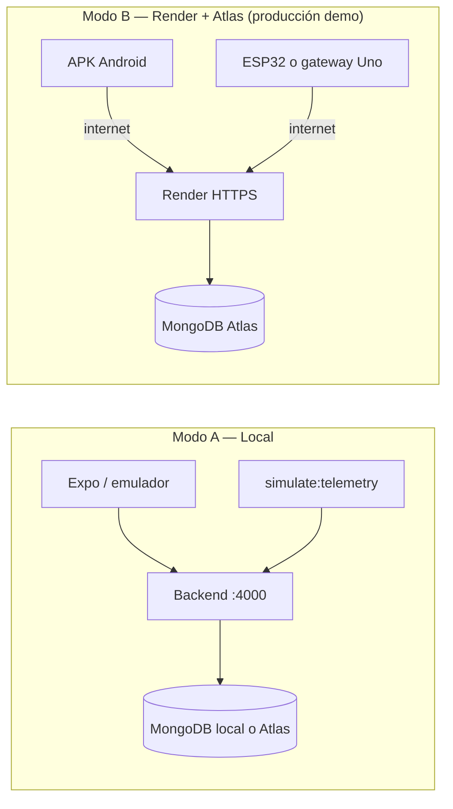
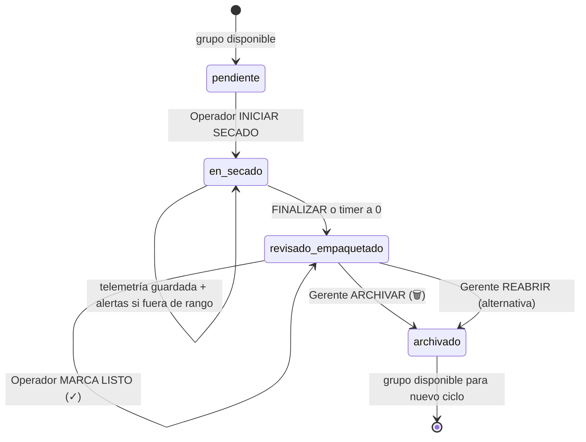

# Guía completa del sistema — App Harinas / Nativa

Documento de referencia para entender **cómo funciona todo** (backend → frontend), **dónde está el código** y **qué pantallas capturar en la app** para documentación visual (fotos, informe, APK).

> **Sobre el UML:** en este repositorio **no hay archivos `.uml` / `.puml`**. Los diagramas oficiales están aquí (Mermaid). Si tenías un UML externo, conviene volver a subirlo a `docs/diagramas/`.

---

## 1. Qué es el sistema

Monorepo **Nativa Superalimentos** para control de planta de secado de harinas:

| Capa | Tecnología | Carpeta |
|------|------------|---------|
| API REST | Node.js + Express 5 + Mongoose | `backend/` |
| Base de datos | MongoDB (`app_harinas`) — local o Atlas | vía `MONGODB_URI` |
| App móvil | Expo SDK 54 + React Native + TypeScript | `frontend/` |
| Sensores | AHT10 (T° + HR) + DS3231 (reloj) | cableado en docs hardware |
| Firmware producción | ESP32 + Wi‑Fi → API | `firmware/esp32-aht10-ds3231/` |
| Firmware examen / kit Uno | Arduino Uno + gateway Node en PC | `firmware/arduino-uno-aht10-ds3231-hc05/` |

### Flujo de datos (siempre el mismo)

```
Sensores (AHT10 + DS3231)
        │ I2C → micro (ESP32 o Uno)
        │ HTTP POST /api/arduino/telemetry
        ▼
   Backend Express  ──►  MongoDB (telemetría, alertas, usuarios, secados)
        │ REST + JWT
        ▼
   APK / Expo (Gerente, Supervisor, Operador)
```

Reglas importantes:

- La **app móvil nunca habla con el Arduino** (ni Bluetooth ni USB). Solo consume el backend por HTTPS.
- El **backend es el único punto de verdad**: guarda telemetría, evalúa alertas, gestiona secados y roles.
- Las **alertas de anomalía** (T°, humedad fuera de rango, etc.) solo se generan si hay un **secado activo** (`ProcesoSecado` en `en_secado`). La telemetría **sí se guarda siempre** que llegue al API, aunque no haya secado.
- Los **grupos de rubro**: 3 parejas iniciales vienen del seed (`npm run seed:grupos`); desde jul/2026 el **gerente puede crear grupos nuevos** desde la app (`POST /api/grupos-rubro`). La lista siempre se ordena por **fecha de creación** (más viejo primero = cola FIFO): Admin crea → Supervisor calibra → Operador despacha en ese orden.

### Rutas de hardware

| Ruta | Cuándo | Requiere PC encendida |
|------|--------|------------------------|
| **ESP32 + Wi‑Fi** (recomendada en planta) | Producción / demo con sensores reales | No — el ESP32 envía directo al API |
| **Arduino Uno + gateway** (kit examen) | Montaje docente, pruebas con Uno | Sí — script Node lee serial y hace POST al API |
| **Simulador** (`npm run simulate:telemetry`) | Desarrollo sin hardware | Sí — solo en la máquina del backend |

---

## 2. Entornos de ejecución y conectividad

El sistema **no es offline-first**: app, backend y base de datos deben poder comunicarse. Lo que cambia entre entornos es **dónde corre cada pieza** y **qué URL usa cada cliente**.

### Modos de operación

| Modo | Uso típico | Backend | MongoDB | App móvil | Telemetría |
|------|------------|---------|---------|-----------|------------|
| **A — Desarrollo local** | Programar en PC, Expo Go, tests | `http://localhost:4000` en tu PC | Local `127.0.0.1:27017` **o** Atlas | `EXPO_PUBLIC_API_URL` → localhost / IP LAN / `10.0.2.2` (emulador) | `npm run simulate:telemetry` |
| **B — Examen / demo (Venezuela)** | APK en teléfono + sensores reales | **Render** `https://app-harinas.onrender.com` | **MongoDB Atlas** (nube) | APK con URL Render embebida (`eas.json` perfil `preview`) | ESP32 o gateway Uno → **HTTPS Render** |
| **C — ngrok (opcional)** | Solo si tu región lo permite | Túnel a backend local | Local o Atlas | URL ngrok en `EXPO_PUBLIC_API_URL` | POST al dominio ngrok |

> **Entorno oficial del proyecto (jun 2026): modo B.** Render + Atlas. ngrok **no funciona** desde Venezuela (ERR_NGROK_9040); no usarlo como plan principal.

### Diagrama por entorno


```mermaid
flowchart LR
  subgraph local["Modo A — Local"]
    APP_L[Expo / emulador]
    BE_L[Backend :4000]
    DB_L[(MongoDB local o Atlas)]
    SIM[simulate:telemetry]
    APP_L --> BE_L --> DB_L
    SIM --> BE_L
  end

  subgraph cloud["Modo B — Render + Atlas (producción demo)"]
    APP_C[APK Android]
    BE_C[Render HTTPS]
    DB_C[(MongoDB Atlas)]
    HW[ESP32 o gateway Uno]
    APP_C -->|internet| BE_C --> DB_C
    HW -->|internet| BE_C
  end
```

### Qué necesita conexión a internet

| Componente | Modo A local | Modo B Render |
|------------|--------------|---------------|
| PC del desarrollador | Solo para levantar backend/Expo | Para seeds, builds EAS, gateway Uno |
| Teléfono con APK | No aplica (Expo en LAN) | **Sí** — login, telemetría, alertas van a Render |
| ESP32 en planta | Solo si `API_URL` apunta a Render | **Sí** — Wi‑Fi de planta + internet |
| Gateway Uno (PC) | Backend local o Render | **Sí** si API es Render |
| MongoDB Atlas desde PC | **Sí** (sin VPN bloqueante) | Render se conecta solo |

### Variables que definen el entorno

| Variable | Dónde | Qué conecta |
|----------|-------|-------------|
| `MONGODB_URI` | `backend/.env` o Render Environment | Backend → MongoDB |
| `EXPO_PUBLIC_API_URL` | `frontend/.env` y `frontend/eas.json` (build APK) | App → Backend |
| `API_URL` | `firmware/**/config.h` o `gateway/.env` | Hardware → `POST .../api/arduino/telemetry` |
| `CORS_ORIGINS` | `backend/.env` / Render | Orígenes permitidos (APK no envía Origin; `*` OK en examen) |

**Valores vigentes (modo B):**

```env
# frontend/.env y eas.json → profile preview
EXPO_PUBLIC_API_URL=https://app-harinas.onrender.com

# gateway Uno o ESP32 config
API_URL=https://app-harinas.onrender.com/api/arduino/telemetry
```

Health check: `GET https://app-harinas.onrender.com/api/health` → `"success": true`

> El plan gratis de Render **duerme** tras inactividad; la primera petición puede tardar 30–60 s.

### Desarrollo local vs APK: diferencia clave

| | Expo Go / `expo start` | APK EAS (`preview`) |
|--|------------------------|---------------------|
| URL del API | Lee `frontend/.env` al arrancar Metro | **Embebida al compilar** en el binario |
| Cambiar backend | Editar `.env` y reiniciar Expo | **Recompilar** APK (`eas build`) |
| Ideal para | Iterar UI en PC | Demo en teléfono real, examen |

Guías detalladas: [`OPERACION-LOCAL.md`](OPERACION-LOCAL.md) (arranque diario) · [`RENDER-DEPLOY.md`](RENDER-DEPLOY.md) (Render + Atlas)

---

## 3. Arquitectura general

```mermaid
flowchart TB
  subgraph Hardware
    SENS[AHT10 + DS3231]
    MCU[ESP32 Wi‑Fi o Uno + gateway PC]
    SENS --> MCU
  end

  subgraph Backend["backend/"]
    API[Express app.js]
    SVC[services/]
    MDL[models/ Mongoose]
    API --> SVC --> MDL
  end

  subgraph DB[(MongoDB app_harinas)]
    MDL --> DB
  end

  subgraph Frontend["frontend/"]
    NAV[RootNavigator.tsx]
    SCR[screens/]
    STO[store/ Zustand]
    SRV[services/ HTTP]
    NAV --> SCR
    SCR --> STO --> SRV
  end

  MCU -->|POST /api/arduino/telemetry| API
  SRV -->|HTTPS + JWT| API
```

---

## 4. Roles y navegación

El rol viene en el JWT tras login. `RootNavigator.tsx` elige el stack:

| Rol en BD | Rol en app | Navigator | Archivo |
|-----------|------------|-----------|---------|
| `gerente` | Gerente / Admin | `GerenteNavigator` | `frontend/src/navigation/RootNavigator.tsx` |
| `supervisor` | Supervisor | `SupervisorNavigator` | idem |
| `operador` | Operador | `OperadorNavigator` | idem |

### Credenciales demo (tras `npm run seed:demo`)

| Rol | Email | Contraseña |
|-----|-------|------------|
| Gerente | `admin@nativa.com` | `admin123` |
| Supervisor | `supervisor@nativa.com` | `supervisor123` |
| Operador | `operador@nativa.com` | `operador123` |

**Truco para el Gerente:** en el Dashboard hay botones **Preview Supervisor** y **Preview Operador** para ver esas pantallas sin cambiar de cuenta.

---

## 5. Mapa pantalla ↔ código ↔ API (para fotos en la app)

Usa esta tabla: abres la app, llegas a la pantalla, y sabes qué archivo implementa qué ves.

### 5.1 Login (todos los roles)

| Lo que ves | Archivo frontend | Backend |
|------------|------------------|---------|
| Pantalla login (logo, cubo verde, formulario) | `frontend/src/screens/LoginScreen.tsx` | `POST /api/auth/login` → `backend/src/routes/auth.routes.js` |
| Componente cubo verde | `frontend/src/components/NativaGreenCube.tsx` | — |
| Logo PNG | `frontend/assets/logo-nativa.png` | — |
| Sesión / token | `frontend/src/store/auth.store.ts` | `backend/src/controllers/auth.controller.js` |

**Foto sugerida:** login completo con logo Nativa y botón INGRESAR.

---

### 5.2 Gerente (Admin)

| Pantalla en app | Título header | Archivo | API principal |
|-----------------|---------------|---------|---------------|
| Inicio / Dashboard | **Inicio** | `frontend/src/screens/DashboardScreen.tsx` | `GET /api/harinas` |
| Gestión de harinas (lista) | **Gestion de Harinas** | `frontend/src/screens/HarinasListScreen.tsx` | CRUD `/api/harinas` |
| Nueva / editar harina | **Nueva Harina** / **Editar Harina** | `frontend/src/screens/HarinaFormScreen.tsx` | `POST/PUT /api/harinas` |
| Equipo (usuarios) | **Equipo** | `frontend/src/screens/EquipoListScreen.tsx` | `GET /api/users` |
| Crear/editar usuario | **Usuario** | `frontend/src/screens/UsuarioFormScreen.tsx` | `POST/PUT /api/users` |
| Muro (telemetría + alertas) | **Muro** | `frontend/src/screens/MuroGerenteScreen.tsx` | `/api/telemetry/*`, `/api/alerts` |
| Lotes pendientes archivo | **Lotes pendientes** | `frontend/src/screens/LotesPendientesArchivoScreen.tsx` | `GET /api/procesos-secado/pendientes-archivo`, `POST .../archivar` |
| Fluctuaciones humedad | **Fluctuaciones humedad** | `frontend/src/screens/FluctuacionesHumedadScreen.tsx` | `GET /api/telemetry/fluctuaciones/humedad`, export PDF |
| Alertas de proceso | **Alertas de proceso** | `frontend/src/screens/AlertsListScreen.tsx` | `GET /api/alerts` |
| Grupos de rubro | **Grupos de rubro** | `frontend/src/screens/GruposListScreen.tsx` | `GET /api/grupos-rubro` (orden cola) |
| Nuevo grupo | **Nuevo grupo** | `frontend/src/screens/GrupoFormScreen.tsx` | `POST /api/grupos-rubro` (solo gerente) |
| Calibración por grupo | **Calibracion** | `frontend/src/screens/CalibracionFormScreen.tsx` | `PUT /api/grupos-rubro/:id` |
| Humedad global | **Humedad global** | `frontend/src/screens/HumedadFormScreen.tsx` | `GET/PUT /api/config/humedad` |
| Preview Supervisor | **Vista Supervisor** | `SupervisorHomeScreen.tsx` (reutilizada) | — |
| Preview Operador | **Vista Operador** | `OperadorHomeScreen.tsx` (reutilizada) | — |

**Cómo llegar desde Dashboard:** botones en `DashboardScreen.tsx` → **Accesos rapidos** (Equipo, Calibracion, Muro, **Fluctuaciones HR**, **Lotes pendientes**, Alertas) y **Gestion de harinas**.

**Checklist fotos Gerente:**

- [ ] Dashboard con contador de inventario
- [ ] Lista de harinas + botón FAB crear
- [ ] Formulario harina (crear o editar)
- [ ] Lista equipo + formulario usuario
- [ ] Muro con gráficas y chips de alertas
- [ ] Lista alertas + export PDF (icono en header si está)
- [ ] Grupos de rubro + pantalla calibración
- [ ] Crear grupo nuevo (Nuevo grupo) → aparece al final de la cola
- [ ] Humedad global
- [ ] Lotes pendientes de archivo (papelera 🗑)
- [ ] Fluctuaciones humedad (supervisor / gerente) + export PDF

---

### 5.3 Supervisor

| Pantalla | Título | Archivo | API |
|----------|--------|---------|-----|
| Home supervisor | **Supervisor** | `frontend/src/screens/SupervisorHomeScreen.tsx` | — |
| Fluctuaciones humedad | **Fluctuaciones humedad** | `frontend/src/screens/FluctuacionesHumedadScreen.tsx` | `GET /api/telemetry/fluctuaciones/humedad` |
| Grupos de rubro | **Grupos de rubro** | `frontend/src/screens/GruposListScreen.tsx` | `GET /api/grupos-rubro` |
| Calibración | **Calibracion** | `frontend/src/screens/CalibracionFormScreen.tsx` | `PUT /api/grupos-rubro/:id` |
| Humedad global | **Humedad global** | `frontend/src/screens/HumedadFormScreen.tsx` | `/api/config/humedad` |

**Checklist fotos Supervisor:**

- [ ] Home con botón "Ver y calibrar grupos"
- [ ] Registro fluctuaciones humedad (7/30 días, chips fuera de rango) + export PDF
- [ ] Lista de grupos en orden de cola (chip "Siguiente en la cola" / "#N en la cola")
- [ ] Formulario calibración (T°, nivel secado, tiempo)
- [ ] Humedad global (% min/max)

---

### 5.4 Operador

| Pantalla | Título | Archivo | API / componentes |
|----------|--------|---------|-------------------|
| Home operador | **Operador** | `frontend/src/screens/OperadorHomeScreen.tsx` | varios |
| Tarjeta por grupo | (en Home) | `OperadorHomeScreen.tsx` + `GrupoRubroCard` | `/api/grupos-rubro`, telemetría |
| Iniciar secado | botón en card | `frontend/src/components/SecadoTimer.tsx` | `POST /api/procesos-secado/grupo/:id/iniciar` |
| Timer + finalizar | chip / botón | `SecadoTimer.tsx` | `POST /api/procesos-secado/:id/completar` |
| Marcar como listo (✓) | botón en card | `OperadorHomeScreen.tsx` | `POST /api/procesos-secado/:id/marcar-listo` |
| Alertas del secado | lista en card | `frontend/src/components/GrupoSecadoAlerts.tsx` | `GET /api/alerts?procesoSecadoId=` |
| Gráfica T/HR | sparkline + gauge | `ChartTrendBlock.tsx`, `MetricGauge.tsx` | `GET /api/telemetry/group/:id` |
| Lista alertas | **Alertas** | `frontend/src/screens/AlertsListScreen.tsx` | `GET /api/alerts` |

**Checklist fotos Operador:**

- [ ] Home con grupos en cola (chip "Siguiente en la cola") y telemetría (T°, HR, chips)
- [ ] Grupo con secado **inactivo** → botón **Iniciar secado**
- [ ] Grupo con secado **activo** → timer + **Finalizar secado**
- [ ] Alertas dentro de la card del grupo (durante secado)
- [ ] Pantalla Alertas (lista completa)
- [ ] Resultado tras finalizar (listo / poco óptimo si aplica)
- [ ] Grupo cerrado → botón **Marcar como listo** (✓)
- [ ] Tras marcar listo, grupo desaparece de la lista operador

**Para que haya datos en pantalla:**

| Entorno | Qué encender |
|---------|--------------|
| Local (modo A) | Backend en PC + `npm run simulate:telemetry` **o** gateway/ESP apuntando al API |
| APK + Render (modo B) | Render despierto (health check) + telemetría llegando a Render + login en app |
| Alertas en card del operador | Además de lo anterior: operador debe **iniciar secado** (alertas de anomalía solo con secado activo) |

---

## 6. Base de datos — modelos Mongoose

Colección MongoDB: **`app_harinas`**. Modelos en `backend/src/models/`.

### 6.1 Diagrama entidad-relación

```mermaid
erDiagram
  User ||--o{ GrupoRubro : "actualizadoPor"
  User ||--o{ ProcesoSecado : "iniciadoPor"
  GrupoRubro ||--o{ TelemetryEvent : "grupoRubroId"
  GrupoRubro ||--o{ ProcessAlert : "grupoRubroId"
  GrupoRubro ||--o{ ProcesoSecado : "grupoRubroId"
  TelemetryEvent ||--o{ ProcessAlert : "telemetryEventId"
  ProcesoSecado ||--o{ ProcessAlert : "procesoSecadoId"
  ProcesoSecado }o--|| TelemetryEvent : "telemetryEventIdInicio"

  User {
    ObjectId _id
    string email
    string nombre
    enum rol "gerente|supervisor|operador"
    string expoPushToken
  }

  Harina {
    ObjectId _id
    string nombre
    string tipo
    number cantidad
    string unidad
    date fecha_registro
  }

  GrupoRubro {
    ObjectId _id
    string codigo
    string nombre
    array items
    object calibracion
  }

  HumedadConfig {
    ObjectId _id
    number min max criticoMin criticoMax
  }

  TelemetryEvent {
    ObjectId _id
    string deviceId
    string eventId
    date timestamp
    object lecturas
  }

  ProcessAlert {
    ObjectId _id
    string tipo
    string severidad
    boolean leida
    boolean eliminada
  }

  ProcesoSecado {
    ObjectId _id
    string estado
    date iniciadoEn finalizaEn
    number duracionMin
    string resultado
    string calificacion
  }
```

### 6.2 Detalle por modelo

| Modelo | Archivo | Para qué sirve |
|--------|---------|----------------|
| **User** | `User.js` | Login, roles, push token |
| **Harina** | `Harina.js` | Inventario CRUD (Gerente) |
| **GrupoRubro** | `GrupoRubro.js` | Parejas de rubros + calibración (T°, nivel, tiempo). 3 sembradas por seed + las que crea el gerente (cola FIFO por `createdAt`) |
| **HumedadConfig** | `HumedadConfig.js` | Umbrales globales de humedad |
| **TelemetryEvent** | `TelemetryEvent.js` | Lecturas ESP32/simulador |
| **ProcessAlert** | `ProcessAlert.js` | Alertas por umbrales o fin de secado |
| **ProcesoSecado** | `ProcesoSecado.js` | Ciclo operador: iniciar → timer → finalizar → calificación |

**Grupos fijos (seed):**

- `garbanzo-lenteja`
- `platano-cambur`
- `yuca-batata`

---

## 7. API REST — endpoints

**Base URL según entorno:**

| Entorno | Base URL |
|---------|----------|
| Desarrollo local | `http://localhost:4000` |
| Emulador Android (misma PC) | `http://10.0.2.2:4000` |
| Teléfono en LAN (backend en PC) | `http://IP_LAN_PC:4000` |
| APK / producción demo | `https://app-harinas.onrender.com` |

Todas las rutas van bajo `/api/...`. La raíz `/` del servicio Render puede devolver 404; usar `/api/health`.

| Método | Ruta | Auth | Rol | Descripción |
|--------|------|------|-----|-------------|
| GET | `/api/health` | No | — | Salud del API |
| POST | `/api/auth/login` | No | — | Login → JWT |
| PUT | `/api/auth/push-token` | Sí | todos | Token Expo push |
| GET/POST/PUT/DELETE | `/api/harinas` | Sí | gerente | CRUD harinas |
| GET/POST/PUT/DELETE | `/api/users` | Sí | gerente | CRUD equipo |
| GET | `/api/grupos-rubro` | Sí | todos* | Lista grupos (orden `createdAt` ASC = cola FIFO) |
| POST | `/api/grupos-rubro` | Sí | gerente | Crear grupo nuevo (entra al final de la cola) |
| GET/PUT | `/api/grupos-rubro/:id` | Sí | supervisor/gerente | Calibración |
| GET/PUT | `/api/config/humedad` | Sí | supervisor/gerente | Humedad global |
| POST | `/api/arduino/telemetry` | No | — | Ingesta ESP32 |
| GET | `/api/telemetry/latest` | Sí | todos | Última lectura por grupo |
| GET | `/api/telemetry/group/:id` | Sí | todos | Historial telemetría |
| GET | `/api/telemetry/fluctuaciones/humedad` | Sí | sup/ger | Registro diario humedad |
| GET | `/api/alerts` | Sí | todos | Listado alertas |
| GET | `/api/alerts/count` | Sí | todos | Contador no leídas |
| PATCH | `/api/alerts/:id/read` | Sí | todos | Marcar leída |
| DELETE | `/api/alerts/:id` | Sí | gerente | Borrado lógico |
| GET | `/api/procesos-secado/activos` | Sí | op/sup/ger | Secados en curso |
| POST | `/api/procesos-secado/grupo/:id/iniciar` | Sí | operador | Iniciar secado |
| POST | `/api/procesos-secado/:id/completar` | Sí | op/ger | Finalizar + calificación |
| POST | `/api/procesos-secado/:id/marcar-listo` | Sí | operador | Confirmar producto listo (✓) |
| POST | `/api/procesos-secado/:id/archivar` | Sí | gerente | Archivar lote (conserva telemetría) |
| GET | `/api/procesos-secado/pendientes-archivo` | Sí | gerente | Lotes listos pendientes de papelera |
| POST | `/api/procesos-secado/grupo/:id/reabrir` | Sí | gerente | Reabrir lote (alternativa a archivar) |

Contrato telemetría: `backend/docs/arduino-telemetry-contract.md`

---

## 8. Flujo operador — secado (diagrama)


```mermaid
stateDiagram-v2
  [*] --> pendiente: grupo disponible
  pendiente --> en_secado: Operador INICIAR SECADO
  en_secado --> en_secado: telemetría guardada + alertas si fuera de rango
  en_secado --> revisado_empaquetado: FINALIZAR o timer a 0
  revisado_empaquetado --> revisado_empaquetado: Operador MARCA LISTO (✓)
  revisado_empaquetado --> archivado: Gerente ARCHIVAR (🗑)
  revisado_empaquetado --> archivado: Gerente REABRIR (alternativa)
  archivado --> [*]: grupo disponible para nuevo ciclo
```

Tras cerrar el secado el backend calcula `resultado`. El operador debe **marcar listo** (`confirmadoListoPorOperador`) antes de que el gerente **archive**. Archivar no borra telemetría ni alertas. El grupo sale de la lista activa del operador solo después del ✓.

Código backend: `backend/src/services/procesoSecado.service.js`  
Código frontend: `procesoSecado.store.ts`, `SecadoTimer.tsx`, `OperadorHomeScreen.tsx`, `LotesPendientesArchivoScreen.tsx`

---

## 9. Estructura de carpetas (lo importante)

```
App-Harinas/
├── backend/
│   ├── src/
│   │   ├── app.js                 ← montaje de rutas Express
│   │   ├── config/env.js          ← variables .env
│   │   ├── models/                ← esquemas MongoDB
│   │   ├── routes/                ← rutas HTTP
│   │   ├── controllers/           ← req/res
│   │   ├── services/              ← lógica de negocio
│   │   ├── middlewares/           ← auth, roles, rate limit
│   │   └── scripts/               ← seed, simulate, backup
│   └── docs/
│       └── arduino-telemetry-contract.md
│
├── frontend/
│   ├── src/
│   │   ├── navigation/RootNavigator.tsx  ← rutas por rol
│   │   ├── screens/                      ← pantallas (fotos aquí)
│   │   ├── components/                   ← UI reutilizable
│   │   ├── store/                        ← estado Zustand
│   │   ├── services/                     ← llamadas HTTP
│   │   ├── theme/index.ts                ← paleta verde Nativa
│   │   └── types/                        ← TypeScript interfaces
│   ├── assets/logo-nativa.png
│   └── eas.json                          ← perfil APK preview
│
├── firmware/
│   ├── README.md
│   ├── esp32-aht10-ds3231/                    ← producción Wi‑Fi
│   └── arduino-uno-aht10-ds3231-hc05/         ← kit Uno + gateway PC
│
└── docs/
    ├── GUIA-SISTEMA-COMPLETA.md    ← este archivo
    ├── OPERACION-LOCAL.md          ← arranque local, Atlas, APK
    ├── RENDER-DEPLOY.md            ← Render + Atlas (modo B)
    └── MONTAJE-HARDWARE-UNO-ESP12F.md
```

---

## 10. Frontend — capas (cómo se conecta una pantalla)

Ejemplo: **Operador ve temperatura**

```
OperadorHomeScreen.tsx
    → useTelemetryStore (store/telemetry.store.ts)
        → telemetry.service.ts
            → api.ts (EXPO_PUBLIC_API_URL + JWT)
                → GET /api/telemetry/latest
                    → telemetry.controller.js
                        → telemetry.service.js
                            → TelemetryEvent (MongoDB)
```

Archivos clave:

| Capa | Patrón de archivos |
|------|-------------------|
| Pantalla | `frontend/src/screens/*Screen.tsx` |
| Estado | `frontend/src/store/*.store.ts` |
| HTTP | `frontend/src/services/*.service.ts` |
| API base | `frontend/src/services/api.ts` |
| Tipos | `frontend/src/types/*.ts` |
| Tema | `frontend/src/theme/index.ts` |

---

## 11. Cómo ejecutar — por entorno

### Modo A — Desarrollo local (PC)

**Terminal 1 — MongoDB** (si no usas Atlas en `MONGODB_URI`):

```powershell
mongod --dbpath C:\data\db --bind_ip 127.0.0.1 --port 27017
```

**Terminal 2 — Backend:**

```powershell
cd backend
npm run dev
```

Verificar: http://localhost:4000/api/health

**Terminal 3 — Seeds** (BD vacía):

```powershell
cd backend
npm run seed:demo
```

**Terminal 4 — Telemetría simulada** (gráficas sin hardware):

```powershell
cd backend
npm run simulate:telemetry
```

**Terminal 5 — Frontend:**

```powershell
cd frontend
# frontend/.env → EXPO_PUBLIC_API_URL=http://localhost:4000  (o IP LAN / 10.0.2.2)
npx expo start -c --port 8082
```

Login: credenciales §4. Sin internet externo si MongoDB es local y el API es localhost.

---

### Modo B — Demo / examen (Render + Atlas + APK)

Este es el flujo **esperado en producción académica** cuando el teléfono no está en la misma red que un PC con backend.

1. Backend ya desplegado: `https://app-harinas.onrender.com`
2. MongoDB en Atlas (`MONGODB_URI` en Render)
3. Seeds en Atlas (una vez): `npm run seed:demo` con `.env` apuntando a Atlas
4. APK compilada con:

```env
EXPO_PUBLIC_API_URL=https://app-harinas.onrender.com
```

```powershell
cd frontend
eas build -p android --profile preview
```

5. Telemetría real: ESP32 o gateway Uno con `API_URL=https://app-harinas.onrender.com/api/arduino/telemetry`
6. Teléfono con **datos móviles o Wi‑Fi con internet** — la app **no funciona** contra un backend local sin estar en la misma LAN

Guía paso a paso: [`RENDER-DEPLOY.md`](RENDER-DEPLOY.md)

---

### Modo C — ngrok (solo si tu región lo permite)

Backend local + túnel ngrok + `EXPO_PUBLIC_API_URL` con dominio ngrok. **No recomendado en Venezuela.** Ver [`OPERACION-LOCAL.md`](OPERACION-LOCAL.md) §3b.

---

## 12. APK — preview e instalación

| Concepto | Valor |
|----------|-------|
| Perfil EAS | `preview` → genera **APK** (`frontend/eas.json`) |
| Comando build | `cd frontend && npx eas-cli build -p android --profile preview` |
| Variable en build | `EXPO_PUBLIC_API_URL` en `frontend/eas.json` → profile `preview` |
| URL vigente | `https://app-harinas.onrender.com` |
| Builds recientes | `npx eas-cli build:list --platform android --limit 5` |

La APK **embebe** la URL del API al compilar. Si cambias de Render a otro host, hay que **recompilar** la APK.

---

## 13. Mapa rápido “¿dónde busco X?”

| Necesito… | Archivo |
|-----------|---------|
| Cambiar colores / verde | `frontend/src/theme/index.ts` |
| Cambiar login / logo | `LoginScreen.tsx`, `NativaGreenCube.tsx`, `assets/logo-nativa.png` |
| Añadir pantalla gerente | `RootNavigator.tsx` + nueva screen |
| Lógica alertas | `backend/src/services/processAlert.service.js` |
| Evaluación umbrales | `backend/src/services/grupoRubro.service.js` (evaluate) |
| Secado operador | `procesoSecado.service.js` + `procesoSecado.store.ts` |
| Marcar listo / archivar lote | `OperadorHomeScreen.tsx`, `LotesPendientesArchivoScreen.tsx` |
| Fluctuaciones humedad | `telemetry.service.js`, `FluctuacionesHumedadScreen.tsx` |
| PDF export | `frontend/src/utils/pdfTemplates.ts`, `pdf/reports.ts` |
| Seeds / usuarios demo | `backend/src/scripts/seedDemo.js` |
| Tests API | `backend/tests/*.test.js` → `npm test` |
| Firmware ESP32 | `firmware/esp32-aht10-ds3231/` |
| Gateway Uno (kit examen) | `firmware/arduino-uno-aht10-ds3231-hc05/gateway/` |
| Variables entorno backend | `backend/.env.example`, `backend/src/config/env.js` |
| URL API en app | `frontend/.env`, `frontend/eas.json` |
| Entornos local vs nube | **Este doc §2**, `OPERACION-LOCAL.md`, `RENDER-DEPLOY.md` |

---

## 14. Qué falta para el informe visual (sugerencia)

| Entrega | Quién | Dónde / cómo |
|---------|-------|--------------|
| **Fotos app por rol** | Ella (en dispositivo) | Checklists secciones 5.2–5.4 |
| **Fotos código** | Ustedes | Archivos listados en tabla “Mapa pantalla ↔ código” |
| **Diagramas UML formales** | Ustedes | No están en repo; usar diagramas Mermaid de este doc o exportar desde draw.io |
| **Preview APK** | Build EAS | Sección 11 + enlace Expo |
| **Esquema BD** | Este doc §6 | Captura del diagrama ER o MongoDB Compass |
| **Arquitectura** | Este doc §3 | Diagrama flowchart |
| **Entornos y conectividad** | Este doc §2 | Tabla modos A/B/C |

**Preguntas útiles para ella (qué más falta):**

- ¿Capturas en modo claro y oscuro?
- ¿Estados del operador con secado activo vs inactivo?
- ¿Pantalla de error (sin red / login fallido)?
- ¿PDF exportado desde harinas, muro o alertas?
- ¿Demo con APK + Render (modo B) vs Expo local (modo A)?

---

## 15. Documentos relacionados

| Documento | Contenido |
|-----------|-----------|
| `README.md` | Instalación general |
| `docs/OPERACION-LOCAL.md` | Arranque local, Atlas, APK, tests |
| `docs/RENDER-DEPLOY.md` | Render + Atlas (modo B, Venezuela) |
| `docs/MONTAJE-HARDWARE-UNO-ESP12F.md` | Cableado Uno, ESP-12F, gateway, checklist |
| `DEPLOY-PLAN.md` | Plan de despliegue |
| `backend/docs/arduino-telemetry-contract.md` | JSON telemetría |
| `firmware/README.md` | ESP32 Wi‑Fi + rutas hardware |
| `docs/AGENTE-ENTREGAS.md` | Prompts por partes (LeanHerz 11/7: ✓ operador, papelera gerente, fluctuaciones) |
| `docs/AGENTE-ENTREGAS-COLA-GRUPOS.md` | Cola FIFO de grupos Admin→Sup→Op, saludos, gráficas (LeanHerz 22/7) — implementada |
| `SPRINTS.md` | Historial de sprints |

---

*Última actualización: julio 2026 — entornos local vs Render+Atlas, rutas hardware Uno/ESP32.*
