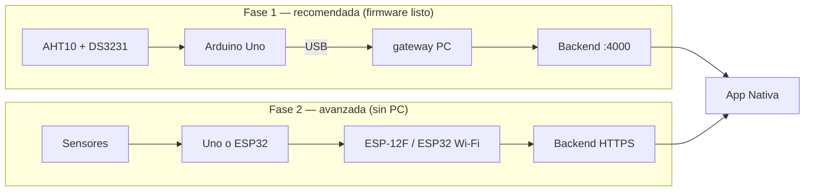

# Montaje hardware — Arduino Uno + DS3231 + AHT10 (+ ESP-12F)

Guía práctica para armar el kit de laboratorio y conectarlo al sistema Nativa (backend + app).

> **Resumen:** la ruta **más rápida con firmware ya listo** es **Uno por USB + gateway en PC**. El **ESP-12F** es opcional y avanzado (no hay sketch listo en el repo). Para planta sin PC, lo ideal es migrar a **ESP32 Dev** (`firmware/esp32-aht10-ds3231/`).

---

## 1. Materiales de tu kit

| Pieza | Función en Nativa |
|-------|-------------------|
| **Arduino Uno** | Lee sensores, arma JSON de telemetría |
| **DS3231** (módulo con pila CR2032) | Hora real → campo `timestamp` |
| **AHT10** (módulo I2C ~4 pines) | Temperatura + humedad (obligatorios en API) |
| **ESP-12F** | Wi‑Fi 3.3 V — fase avanzada, sin firmware en repo |
| **Regulador 12 V** | Entrada desde fuente/batería 12 V |
| **Regulador 5 V** (ej. 7805) | Alimenta Arduino Uno |
| **Regulador 3.3 V** (ej. AMS1117-3.3) | Alimenta ESP-12F **solo 3.3 V** |
| **Resistencias 10 kΩ** | Pull-up/pull-down del ESP-12F |
| **104 cerámicos** | **0,1 µF** (100 nF) — desacople junto a reguladores |
| **100 µF electrolíticos** (si los tienes) | Entrada/salida de reguladores de potencia |

### Aclaración condensadores

- Marcado **104** en cerámico = **100 nF** (0,1 µF), **no** 100 µF.
- Los **100 µF** suelen ir en la **entrada 12 V** y en la **salida 5 V** si alimentas varios módulos.

### Pila del DS3231

- Sin CR2032 el reloj **pierde la hora** al apagar.
- Para pruebas puedes usar una CR2032 prestada (ej. de la PC); para planta conviene una pila nueva en el módulo.

---

## 2. Qué ruta usar



| Ruta | Cuándo | Firmware / carpeta |
|------|--------|-------------------|
| **Uno + USB + gateway** | Demo, desarrollo, informe | `firmware/arduino-uno-aht10-ds3231-hc05/` |
| **ESP32 Dev + Wi‑Fi** | Producción en planta | `firmware/esp32-aht10-ds3231/` |
| **Uno + ESP-12F** | Experimental | **No incluido** — requiere programar ESP8266 aparte |

---

## 3. Cableado — Fase 1 (Uno + sensores)

### 3.1 Bus I2C compartido (AHT10 + DS3231)

Los dos módulos comparten **SDA** y **SCL**:

| Señal | Arduino Uno |
|-------|-------------|
| **SDA** | **A4** |
| **SCL** | **A5** |
| **VCC** | **5 V** |
| **GND** | **GND** |

```
        ┌─────────────┐
        │ Arduino Uno │
        │  A4 ── SDA ─┼──► DS3231 SDA ──► AHT10 SDA
        │  A5 ── SCL ─┼──► DS3231 SCL ──► AHT10 SCL
        │  5V ── VCC ─┼──► ambos VCC
        │  GND ───────┼──► ambos GND
        └─────────────┘
```

### 3.2 Alimentación en mesa (prueba rápida)

**Opción A — solo USB (recomendada para empezar):**

- Conecta el Uno a la PC por USB.
- No necesitas reguladores 12 V/5 V todavía.

**Opción B — fuente 12 V externa:**

```
12 V ──► [Regulador 5 V / 7805] ──► 5 V ──► Arduino (pin 5V o VIN 7–12 V)
              │
              ├── 104 entre IN–GND y OUT–GND (cerca del chip)
              └── 100 µF opcional IN y OUT
```

- **GND común** entre fuente, Uno y protoboard.
- No superar **12 V** en VIN del Uno de forma prolongada sin disipador en el 7805.

---

## 4. Cableado — ESP-12F (Fase 2, opcional)

> El ESP-12F trabaja a **3.3 V**. **Nunca** conectar VCC a 5 V.

### 4.1 Alimentación 3.3 V

```
5 V (del 7805) ──► [Regulador 3.3 V] ──► ESP-12F VCC
                        │
                        └── 104 en IN/OUT
```

Corriente: reserva **≥ 300 mA** estables para el ESP-12F en Wi‑Fi.

### 4.2 Pines de arranque (obligatorios)

| Pin ESP-12F | Conexión |
|-------------|----------|
| **VCC** | 3.3 V |
| **GND** | GND común |
| **CH_PD / EN** | 3.3 V vía **10 kΩ** a VCC (pull-up) |
| **GPIO15** | GND vía **10 kΩ** (pull-down — debe estar bajo al boot) |
| **GPIO0** | 3.3 V vía **10 kΩ** (modo ejecución; bajo = flash) |
| **GPIO2** | 3.3 V vía **10 kΩ** (recomendado) |

### 4.3 Serial con Arduino (si Uno envía JSON al ESP)

Usar **SoftwareSerial** en pines **10 y 11** (no 0/1, para poder programar por USB):

| Señal | Conexión |
|-------|----------|
| Uno **TX** pin **11** | ESP **RX** — **divisor 5 V→3.3 V** |
| Uno **RX** pin **10** | ESP **TX** (3.3 V suele leer bien el Uno) |
| **GND** | GND común |

**Divisor de voltaje** (Uno TX → ESP RX):

```
Arduino pin 11 (TX) ──[10 kΩ]──┬── ESP RX
                               │
                            [20 kΩ]   (o 1 kΩ + 2 kΩ si tienes esos valores)
                               │
                              GND
```

> Hoy el repo **no incluye** sketch para ESP-12F. Para Wi‑Fi directo sin PC, usa **ESP32 Dev** con `firmware/esp32-aht10-ds3231/`.

---

## 5. Software — operación local completa

### 5.1 Orden de arranque

| # | Terminal | Comando |
|---|----------|---------|
| 1 | MongoDB (si local) | `mongod --dbpath C:\data\db --bind_ip 127.0.0.1 --port 27017` |
| 2 | Backend | `cd backend` → `npm run dev` |
| 3 | Gateway | `cd firmware\arduino-uno-aht10-ds3231-hc05\gateway` → `npm start` |
| 4 | App (opcional) | `cd frontend` → `npx expo start -c --port 8082` |
| 5 | ngrok (APK/teléfono) | `npx ngrok http --domain=conciliarly-interpetaloid-marisol.ngrok-free.app 4000` |

Comprobar backend: http://localhost:4000/api/health → `success: true`

### 5.2 `backend/.env` (local)

```env
PORT=4000
MONGODB_URI=mongodb://127.0.0.1:27017/app_harinas
TRUST_PROXY=1
JWT_SECRET=super_secreto_nativa_2026
```

Datos demo (una vez):

```powershell
cd backend
npm run seed:demo
```

### 5.3 Sketch Arduino Uno

1. [Arduino IDE](https://www.arduino.cc/en/software) → placa **Arduino Uno**.
2. Librerías: **Adafruit AHTX0**, **RTClib**, **ArduinoJson 6**.
3. Copiar:
   - `firmware/arduino-uno-aht10-ds3231-hc05/nativa_uno_telemetry/config.example.h`
   - → `config.h` (misma carpeta)
4. Abrir `nativa_uno_telemetry.ino` → **Subir**.
5. Monitor serie **115200**: cada 30 s JSON con `temperatura`, `humedad`, `timestamp`.

**Ajustes en `config.h`:**

| Variable | Ejemplo | Descripción |
|----------|---------|-------------|
| `CODIGO_GRUPO` | `garbanzo-lenteja` | Grupo en backend |
| `DEVICE_ID` | `uno-secador-01` | ID del secador |
| `INTERVAL_MS` | `30000` | Intervalo entre lecturas |
| `MIRROR_USB_SERIAL` | `1` | Envía JSON por USB (necesario para gateway) |

### 5.4 Gateway (Uno → API)

```powershell
cd firmware\arduino-uno-aht10-ds3231-hc05\gateway
npm install
copy .env.example .env
```

Editar `.env`:

```env
SERIAL_PORT=COM3
SERIAL_BAUD=115200
API_URL=http://localhost:4000/api/arduino/telemetry
```

- `SERIAL_PORT`: **Administrador de dispositivos** → Puertos COM → Arduino Uno.
- `npm start` → debe mostrar `POST 201` o `POST 200` al recibir JSON del Uno.

### 5.5 App móvil

| Rol | Email | Contraseña |
|-----|-------|------------|
| Operador | `operador@nativa.com` | `operador123` |
| Supervisor | `supervisor@nativa.com` | `supervisor123` |
| Gerente | `admin@nativa.com` | `admin123` |

En **Operador** → elegir grupo → **Iniciar secado** → ver T°, HR, timer y alertas.

Sin hardware aún:

```powershell
cd backend
npm run simulate:telemetry
```

### 5.6 APK + ngrok

1. Backend en marcha (`npm run dev`).
2. ngrok al puerto 4000 (dominio reservado).
3. EAS preview: `EXPO_PUBLIC_API_URL=https://conciliarly-interpetaloid-marisol.ngrok-free.app`
4. En el teléfono: abrir la URL ngrok en el navegador una vez (aceptar aviso) antes de usar la APK.

---

## 6. JSON que envía el Uno

Contrato: [`backend/docs/arduino-telemetry-contract.md`](../backend/docs/arduino-telemetry-contract.md)

```json
{
  "eventId": "uno-secador-01-20260619143000",
  "deviceId": "uno-secador-01",
  "codigoGrupo": "garbanzo-lenteja",
  "timestamp": "2026-06-19T14:30:00.000Z",
  "lecturas": {
    "temperatura": 41.2,
    "humedad": 54.1
  }
}
```

Grupos válidos: `garbanzo-lenteja`, `platano-cambur`, `yuca-batata`.

---

## 7. Checklist de montaje

### Eléctrico

- [ ] GND común Uno + sensores + (si aplica) ESP-12F
- [ ] AHT10 y DS3231 en **A4/A5**
- [ ] CR2032 en DS3231 (o aceptar ajuste de hora al encender)
- [ ] 104 cerámico junto a cada regulador
- [ ] ESP-12F **solo 3.3 V** (nunca 5 V en VCC)
- [ ] Divisor de voltaje si Uno TX → ESP RX

### Software

- [ ] Monitor serie muestra JSON cada 30 s
- [ ] `GET /api/health` OK
- [ ] Gateway con `SERIAL_PORT` correcto → `POST 201`
- [ ] `npm run seed:demo` si BD vacía
- [ ] Operador inicia secado → telemetría visible en app

---

## 8. Problemas frecuentes

| Síntoma | Causa probable | Acción |
|---------|----------------|--------|
| `AHT10 no detectado` | Cable SDA/SCL mal | Revisar A4/A5, VCC, GND |
| `DS3231 no detectado` | Mismo bus I2C | Misma revisión |
| Gateway no recibe datos | COM incorrecto | Cambiar `SERIAL_PORT` en `.env` |
| Gateway `ECONNREFUSED` | Backend apagado | `npm run dev` en backend |
| Hora incorrecta | Sin pila CR2032 | Poner pila o recompilar sketch (ajuste hora) |
| App sin telemetría | Secado no iniciado | Operador → **Iniciar secado** |
| ESP-12F no arranca | GPIO15/CH_PD mal | Revisar pull-up/down 10 kΩ |
| ESP-12F se calienta | Alimentado a 5 V | **Solo 3.3 V** |

---

## 9. Próximo paso recomendado (planta)

Comprar **ESP32 Dev Module** (~USD 5–8), reutilizar **AHT10 + DS3231** en I2C (pines 21/22), firmware:

- [`firmware/esp32-aht10-ds3231/README.md`](../firmware/esp32-aht10-ds3231/README.md)

Así el secador envía Wi‑Fi al backend **sin PC ni gateway**.

---

## 10. Documentos relacionados

| Documento | Contenido |
|-----------|-----------|
| [`OPERACION-LOCAL.md`](OPERACION-LOCAL.md) | ngrok, seeds, APK, tests |
| [`GUIA-SISTEMA-COMPLETA.md`](GUIA-SISTEMA-COMPLETA.md) | Mapa pantalla ↔ código ↔ API |
| [`firmware/README.md`](../firmware/README.md) | Arquitectura telemetría |
| [`firmware/arduino-uno-aht10-ds3231-hc05/README.md`](../firmware/arduino-uno-aht10-ds3231-hc05/README.md) | Gateway y sketch Uno |
